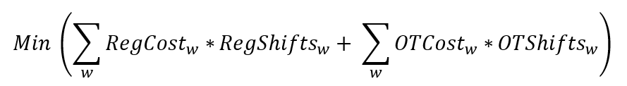

# **Cost Optimization for Python**

# PROJECT DESCRIPTION:
Congratulations! You’re the proud new owner of the coolest store in town. To keep the operation running, you need to ensure that you have the correct number of workers scheduled for each shift. In this tutorial, we’ll design the lowest cost schedule for the upcoming week.

# Consideration:
For the coming week, each day has two shifts of 8 hours. You currently have ten employees, four of which are considered managers. For any shifts beyond 40 hours in a given week (5 total shifts), you pay your employees overtime. To be fair to your employees, you decide that everyone has to work at least 3 shifts, but no more than 7 shifts. And to ensure that the shop runs smoothly, each shift requires at least one manager.

# **Structuring the Problem**

# Objective Function:
In simple words, we want to design the lowest cost schedule, accounting for both regular time and overtime. We can define this mathematically as:

Where w is our list of workers, RegCost and OTCost are the dollar costs of a regular and overtime shift for each worker, respectively, and RegShifts and OTShifts are the total number of regular and overtime shifts for each worker, respectively.

# Variables:
We will create a list of variables for every worker/shift combination (e.g. [‘Employee1’,‘Monday1'], [‘Employee2’,‘Monday1’], etc.). Each of these variables will be a binary value to signify if a worker is scheduled (1) or not (0). We’ll also need to deal with the split of regular time and overtime, which we’ll handle as a hybrid of variable and constraint.

# Constraints:
From the problem statement above, we know that there are a number of special considerations that we need to follow. To make sure that our optimized schedule is acceptable, we’ll create specific constraints:
+ Total number of workers staffed equals total number of workers required for each shift
+ Workers must stay between global minimum and maximum number of shifts
+ Workers can only be scheduled when they are available (handled in decision variable ‘x’)
+ At least one manager staffed per shift